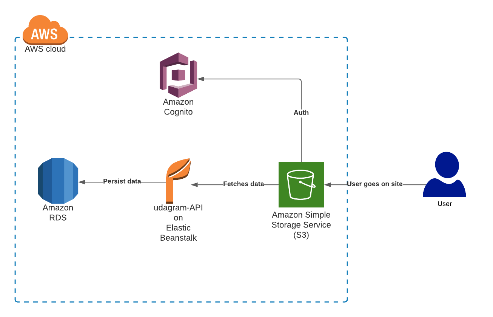
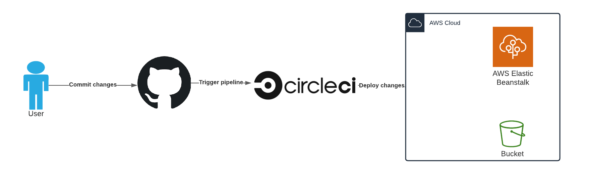

## Project arch


## Pipeline overview



## Project setup

1. Make sure to add this project into your circleci
1. Add the following env variables to your circleci project (this one)
    ```
    AWS_ACCESS_KEY_ID	
    AWS_DEFAULT_REGION	
    AWS_SECRET_ACCESS_KEY	
    ```
1. After that make sure to create ElasticBeanstalk (EB) app with nodejs as a plateform
1. Update  `udagram/udagram-api/.elasticbeanstalk/config.yml` with your EB values
1. After that you will need to create RDS and pass the db information as env variables to your software env over aws 
    ```
    AWS_BUCKET
    AWS_PROFILE
    AWS_REGION
    JWT_SECRET
    PORT
    POSTGRES_DB
    POSTGRES_HOST
    POSTGRES_PASSWORD
    POSTGRES_USERNAME
    URL
    ```
1. Inorder to serve the FE you will need to create s3 bucket that's readable
1. After creating the bucket, update `YOUR-BUCKET-NAME` with the new bucket name in this file (`udagram/udagram-frontend/bin/deploy.sh`)  
    ```
    aws s3 cp --recursive --acl public-read ./build s3://YOUR-BUCKET-NAME

    ```
That's it.